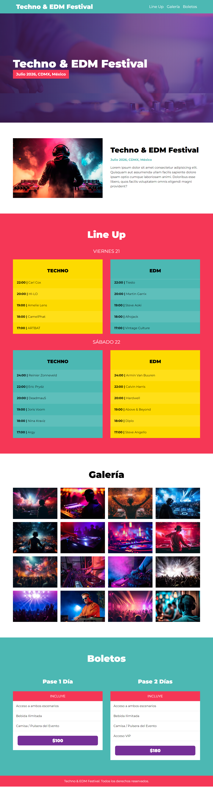

# Festival de Música - Techno & EDM

Este proyecto es un sitio web para un festival de música Techno & EDM, desarrollado con SASS, HTML y JavaScript.



## Instalación

Para instalar las dependencias necesarias, ejecuta:

```
npm install
```

## Ejecución

Para compilar los archivos y empezar a trabajar, utiliza el comando:

```
npm run dev
```

Esto iniciará un servidor local y compilará los archivos SASS a CSS, así como cualquier JavaScript necesario.

## Vista Previa

El proyecto incluye varias secciones:

- **Home**: Video de presentación y detalles del festival.
- **Line Up**: Programación por días y escenarios.
- **Galería**: Sección de imágenes del evento.
- **Boletos**: Información sobre los tipos de pases y precios.

## Tecnologías Utilizadas

- HTML
- SASS
- JavaScript

## Créditos

- Desarrollado por: Andonys24